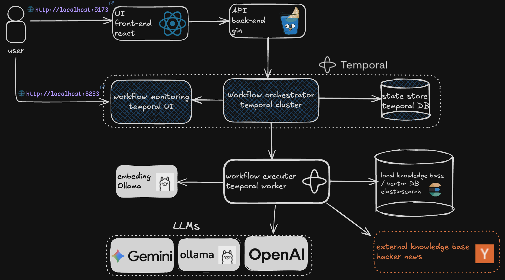
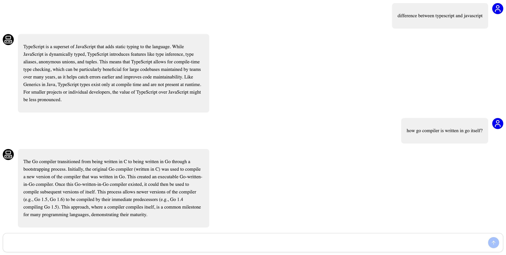
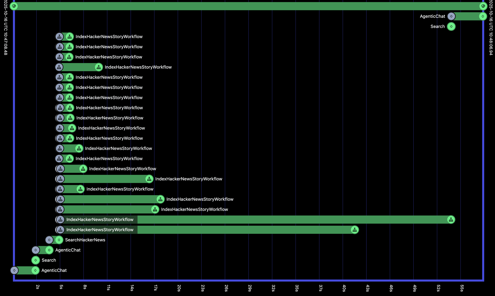

# AskHN: Temporal-powered Agentic RAG over Hacker News

An Agentic Retrieval-Augmented Generation (RAG) system that explores and indexes Hacker News content into Elasticsearch, and orchestrates RAG workflows with Temporal.

## Overview

People frequently ask questions about current tech topics that are actively discussed on Hacker News (HN). General-purpose LLMs may hallucinate or miss context from ongoing HN discussions. This project solves this by:

- Indexing Hacker News comments into an Elasticsearch Knowledge Base
- Retrieving relevant context for user questions using hybrid search (text + vector)
- Constructing prompts with the retrieved context and sending them to the configured LLM
- Using an agentic loop to explore and expand the knowledge base before answering

The system implements an end-to-end, agentic RAG application that ingests datasets into a knowledge base, implements retrieval and prompting to an LLM, and exposes both API and UI interfaces.

## Dataset

[Hacker News](https://news.ycombinator.com/news) stories and comments via [official Firebase API](https://github.com/HackerNews/API?tab=readme-ov-file) and [Algolia Search](https://hn.algolia.com/).

## Tech Stack & Architecture



**Core Technologies:**

- **Language**: Go 1.22+
- **Orchestration**: Temporal (server + UI)
- **Storage/KB**: Elasticsearch 8.4.x
- **API**: Gin
- **UI**: Vite + React + TypeScript (`ui/`)
- **LLMs**: Gemini, OpenAI, Ollama-compatible HTTP API
- **Embeddings**: Ollama with mxbai-embed-large model
- **Containers**: Docker + docker-compose

**Architecture Components:**

- **Ingestion/Orchestration**: Temporal Workflows and Activities (`internal/temporal`) coordinate fetching HN items and indexing into Elasticsearch.

  - `IndexHackerNewsStoryWorkflow` recursively pulls a story and its comments and indexes them.
  - `RetrivalAugmentedGenerationWorkflow` and `ProsConsRagWorkflow` implement classic RAG.
  - `AgenticRAGWorkflow` runs an agent loop that can trigger new indexing when needed.

- **External Knowledge Base**: Hacker News Comments
- **Local Knowledge Base**: Elasticsearch 8.x (`internal/elasticsearch`) with hybrid search capabilities
- **LLM Layer**: Pluggable LLM client (`internal/llm`) supporting Gemini, OpenAI and Ollama
- **Embedding**: Ollama (`internal/embeding`) with mxbai-embed-large model
- **API**: Gin HTTP server exposing RAG endpoints (`cmd/api`, `internal/api`)
- **UI**: Vite/React app in `ui/` with chat experiences
- **Containers**: `docker-compose.yml` spins up Temporal, Temporal UI, Elasticsearch, API, Worker, and Ollama

## High-Level Flow

1. **User Query**: User sends a query through the UI which sends to the API service
2. **Workflow Initiation**: API service initiates an agentic RAG temporal workflow
3. **Worker Assignment**: Temporal worker periodically sends heartbeat to the temporal server and requests jobs
4. **Task Distribution**: Temporal server assigns the workflow and tasks to the temporal worker
5. **Agentic Logic**: Temporal worker handles the logic of agentic RAG
6. **Action Decision**: LLM determines the next action based on [agentic prompt](./internal/llm/prompts/agentic.txt)
7. **Local Search**: LLM first searches the local knowledge base via hybrid search (combination of text and vector search)

   _The system has two knowledge sources:_

   - **External source** (Hacker News): Lots of data but not optimized for searching
   - **Local knowledge base** (Elasticsearch): Optimized for searching long texts

   _Search strategy:_

   - Complex and long search queries work well on the local knowledge base
   - If response is empty, insufficient, or not related, fetch from external source
   - External searches use minimal keywords (1-2 keywords) for better results

8. **External Exploration**: If data is insufficient, LLM searches Hacker News using keywords via [Hacker News Search](https://hn.algolia.com/) and indexes the comments into the local knowledge base
9. **Response Generation**: After indexing new data, the system searches the updated knowledge base and creates a response

## Getting Started

### Prerequisites

- Docker and Docker Compose
- An LLM provider key (e.g., Gemini or OpenAI) or local Ollama with a model installed

### Environment Setup

Copy and adapt the example environment file:

```bash
cp example.env .env
# Then edit .env to set:
# GEMINI_API_KEY / OPEN_AI_API_KEY
# LLM (gemini|openai|ollama) and LLM_MODEL
```

### Run with Docker Compose (Recommended)

```bash
docker compose up --build
```

This starts:

- Postgres (Temporal persistence)
- Temporal server at `localhost:7233`
- Temporal UI at `http://localhost:8233`
- Elasticsearch at `http://localhost:9200`
- API at `http://localhost:8080`
- React UI at `http://localhost:5173`
- Worker process for workflows
- Ollama with mxbai-embed-large model

## Usage

### Web Interface

- Open the UI via `http://localhost:5173`
- Chat with the chatbot and ask questions you want answered based on Hacker News comments



### Monitoring

- Open Temporal UI at `http://localhost:8233` to see workflow status and running activities



## Data Ingestion

The system implements automated ingestion through Temporal workflows:

- **`IndexHackerNewsStoryWorkflow`**: Takes an HN item ID, fetches the story, traverses comments (`kids`), and indexes documents into Elasticsearch with fields `{id, score, title, type, text}`

- **Agentic RAG Integration**: May trigger ingestion by:

  - Calling Algolia HN Search to discover related stories
  - Launching child workflows to index each story and its comments

- **Manual Triggering**: Can be initiated via CLI or Temporal UI signals; see `internal/temporal/workflows.go` for implementation details

## Retrieval and Prompting

### Retrieval Strategy

- **Hybrid Search**: Combines text search and vector search for optimal results
- **Text Search**: `TextSearch(query, size)` boosts `title` over `text` and returns ES documents
- **Vector Search**: Uses mxbai-embed-large embeddings for semantic similarity

### Prompting Architecture

- **Template-driven**: System prompts are generated from templates (`internal/llm/prompts/`) with injected context
- **Classic Flows**:
  - `RetrivalAugmentedGenerationWorkflow`: Builds context from top-K docs and calls `LLMActivities.Chat`
  - `ProsConsRagWorkflow`: Builds stance-aware system prompt (agree/disagree) then calls the LLM
- **Agentic Flow**:
  - Iteratively calls `LLMActivities.AgenticChat` to decide actions (answer vs explore)
  - May index new data, then provides final answer

## Local Development

### Prerequisites

- Go 1.22+
- Node.js and Yarn
- Temporal CLI
- Docker (for Elasticsearch and Ollama)

### Setup

1. **Temporal (dev)**: `temporal server start-dev`
2. **Elasticsearch**:
   ```bash
   docker run -it --rm --name elasticsearch \
     -p 9200:9200 -p 9300:9300 \
     -e "discovery.type=single-node" \
     -e "xpack.security.enabled=false" \
     elasticsearch:8.4.3
   ```
3. **Ollama with Embeddings**:
   ```bash
   docker run -d --name ollama -p 11434:11434 -v ollama_data:/root/.ollama ollama/ollama
   docker exec ollama ollama pull mxbai-embed-large:latest
   ```
4. **API**: `go run cmd/api/main.go`
5. **Worker**: `go run cmd/worker/main.go`
6. **UI**: `cd ui; yarn dev`

## Project Structure

```
├── cmd/
│   ├── api/main.go          # API server entry point
│   └── worker/main.go       # Temporal worker entry point
├── internal/
│   ├── api/                 # Gin API handlers
│   ├── config/              # Configuration management
│   ├── elasticsearch/       # ES client and search logic
│   ├── embeding/            # Ollama embedding client
│   ├── hackernews/          # HN API client
│   ├── llm/                 # LLM clients and prompt templates
│   └── temporal/            # Temporal workflows and activities
├── ui/                      # React frontend
└── docker-compose.yml       # Complete stack orchestration
```

<!--todo remove-->
## Evaluation & Quality

This project implements several evaluation criteria:

- **Retrieval Flow**: Uses both knowledge base and LLM in the flow
- **Hybrid Search**: Combines text and vector search for improved retrieval
- **Multiple LLM Approaches**: Supports different LLM providers and prompt strategies
- **Interface**: Provides both REST API and React UI
- **Automated Ingestion**: Temporal workflows handle data ingestion
- **Containerization**: Complete docker-compose setup
- **Reproducibility**: Clear instructions with specified dependency versions
